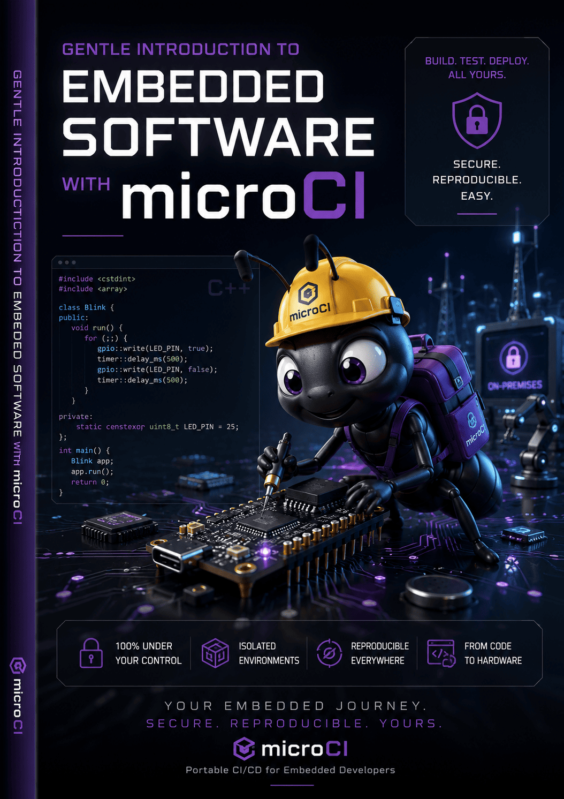

# Gentle Introduction to Embedded Software with microCI

[Latest book version](http://microci.dev/) · [microCI](http://microci.dev/)

A practical embedded software book powered by microCI.

This living book explores embedded software development with microCI as the workflow companion and the Raspberry Pi Pico family as the reference platform. It is designed to show how embedded software is built in practice: through real boards, real code, and a workflow that can stay maintainable as a project grows.

## About this project

The book and microCI evolve together. That makes the examples practical, reproducible, and close to real embedded workflows. The goal is to help readers understand embedded concepts and how to apply them in projects that keep growing over time.

This is not a Pico-only book. The Pico family is the platform used to teach the ideas, but the real focus is the embedded development process and the workflows that microCI helps support.

Future editions can expand to additional boards and ecosystems as microCI grows.

Read the latest version of the book at:

- http://microci.dev/

## What you will learn

This book walks through the essentials of embedded development:

- firmware structure
- communication protocols
- peripherals and interrupts
- timing and memory constraints
- testing and automation

## Why microCI

microCI is being built to make embedded workflows more reproducible, practical, and scalable. The book grows alongside that effort, showing how a compact board family can still support a complete embedded software workflow.

## Current focus

The current edition centers on:

- Raspberry Pi Pico
- Raspberry Pi Pico W
- Raspberry Pi Pico 2
- Raspberry Pi Pico 2 W

These boards are enough to cover the book and to demonstrate microCI across closely related hardware variants.

## Project status

This book is under active development.

Chapters, examples, and diagrams evolve with microCI, so the online version is the best place to follow the latest progress.

## Follow along

To see the book take shape and learn more about microCI, visit:

- http://microci.dev/
