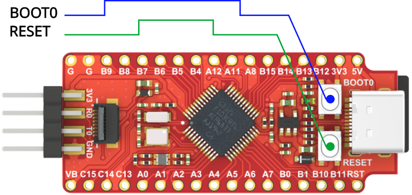

=== Sipeed Longan Nano

The Sipeed Longan Nano is a minimalist RISC-V development board based on the
GigaDevice GD32VF103CBT6.

.Sipeed Longan Nano board
image::../images/longan_nano.jpg[pdfwidth=70%]

According to Sipeed, the board draws out all of the chip's I/Os and includes
on-board USB-C, LCD, SD card, JTAG, and other interfaces.
That makes it a compact but practical board for students, engineers, and
enthusiasts who want to learn the latest generation of RISC-V processors.

It belongs in the hardware chapter because it gives the book a second concrete
board to discuss alongside the Raspberry Pi Pico family.
That makes it easier to compare ecosystems, instruction-set choices, and board
layouts without turning the book into a vendor catalog.

The Longan Nano is especially useful when introducing the idea that different
microcontrollers can support the same embedded concepts even when their
architecture, toolchain, and board support differ.

=== Specification

[cols="1,5",options="header"]
|===
|Feature|Description
|CPU|GD32VF103CBT6 based on RISC-V 32-bit core
|Core power consumption|1/3 of a traditional Cortex-M3
|Storage|128KB Flash, 32KB SRAM
|Peripherals|4 x general purpose 16-bit timer, 2 x basic 16-bit timer, 1 x advanced 16-bit timer, Watchdog, RTC, Systick 3 x USART, 2 x I2C, 3 x SPI, 2 x I2S, 2 x CAN, 1 x USBFS (OTG), 2 x ADC (10 channel), 2 x DAC
|Buttons|1x Reset button, 1x BOOT button (connected to GPIO）
|Display Interface|SPI interface (standard 0.96 inch 160x80 RGB IPS LCD）
|Storage Interface|Onboard TF card slot
|Debug Interface|2x 4 pin headers connected to JTAG debug interface and serial port
|Crystal Oscillator|8MHz passive crystal + 32.768KHz RTC passive crystal
|LED|1x RGB LED
|Number of GPIOs|2 Lead out 28 GPIOs to pin headers
|===

// https://erickof.medium.com/getting-started-with-risc-v-platformio-and-the-sipeed-longan-nano-1ebc3dd606bb
// The chip has built-in 128 KB Flash memory, 32 KB SRAM, and rich peripheral support:
//
// 4 × 16-bit general-purpose timers
// 2 × 16-bit basic timers
// 1 × 16-bit advanced timer
// Watchdog timer
// RTC and Systick
// 3 × USART, 2 × I2C, 3 × SPI
// 2 × I2S, 2 × CAN
// 1 × USBFS (OTG)
// 2 × 10-channel ADC
// 2 × DAC

=== Pinout

.Sipeed Longan Nano pinout
image::../images/longan-nano-pinout.svg[pdfwidth=100%]

=== Detecting the board on Linux

When plugged to USB the Longan Nano board does not appears in `lsusb` or `dmesg`
commands.

To get the Longan Nano to show up on Linux after plugging it in, you must
manually trigger the hardware bootloader interface. The `GD32VF103` chip on this
board does not automatically enter programming mode when you connect the USB
cable.

To flash over USB without root privileges, create a udev rule for the `GD32VF103`
bootloader. Create a rule file called `99-longan-nano.rules` in `/etc/udev/rules.d/`:

[%autofit]
----
# /etc/udev/rules.d/99-longan-nano.rules
KERNEL=="ttyUSB[0-9]*", MODE="0666"
SUBSYSTEM=="usb", ATTRS{idVendor}=="28e9", ATTRS{idProduct}=="0189", MODE="0666"
SUBSYSTEM=="usb_device", ATTRS{idVendor}=="28e9", ATTRS{idProduct}=="0189", MODE="0666"
----

Then reload the rule files:

[source,console]
----
$ sudo udevadm control --reload-rules
$ sudo udevadm trigger
----

Apply the boot sequence to put the board in DFU (Device Firmware Upgrade) mode:

* Press and hold the `BOOT0` button.
* Press and release the `RESET` button.
* Release the `BOOT0` button.

.Sipeed Longan Nano boot sequence.

After the boot sequence be executed the board appears on `dmesg`:

[source,console]
----
# dmesg -w
...
[30731.654522] usb 1-3: USB disconnect, device number 9
[30732.670891] usb 1-3: new full-speed USB device number 10 using xhci_hcd
[30732.843662] usb 1-3: New USB device found, idVendor=28e9, idProduct=0189, bcdDevice= 1.00
[30732.843668] usb 1-3: New USB device strings: Mfr=1, Product=2, SerialNumber=3
[30732.843671] usb 1-3: SerialNumber: 䌳䩂
[30732.876158] usb 1-3: usbfs: process 3394 (fwupd) did not claim interface 0 before use
----

As well in the `lsusb` list:

[source,console]
----
# lsusb
...
Bus 001 Device 009: ID 28e9:0189 GDMicroelectronics GD32 DFU Bootloader (Longan Nano)
----

// It indicates that the device has enumerated as a USB Full-Speed DFU bootloader,
// allowing firmware to be uploaded over USB without requiring a JTAG or SWD
// debugger.

