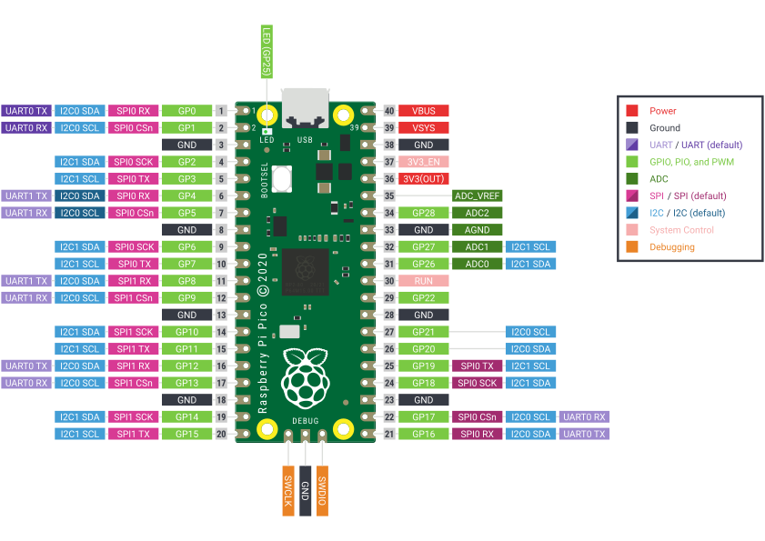
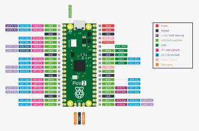
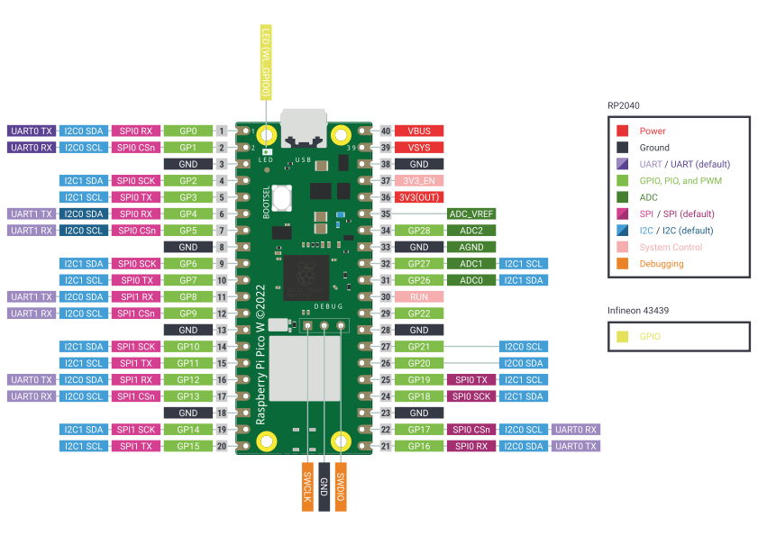
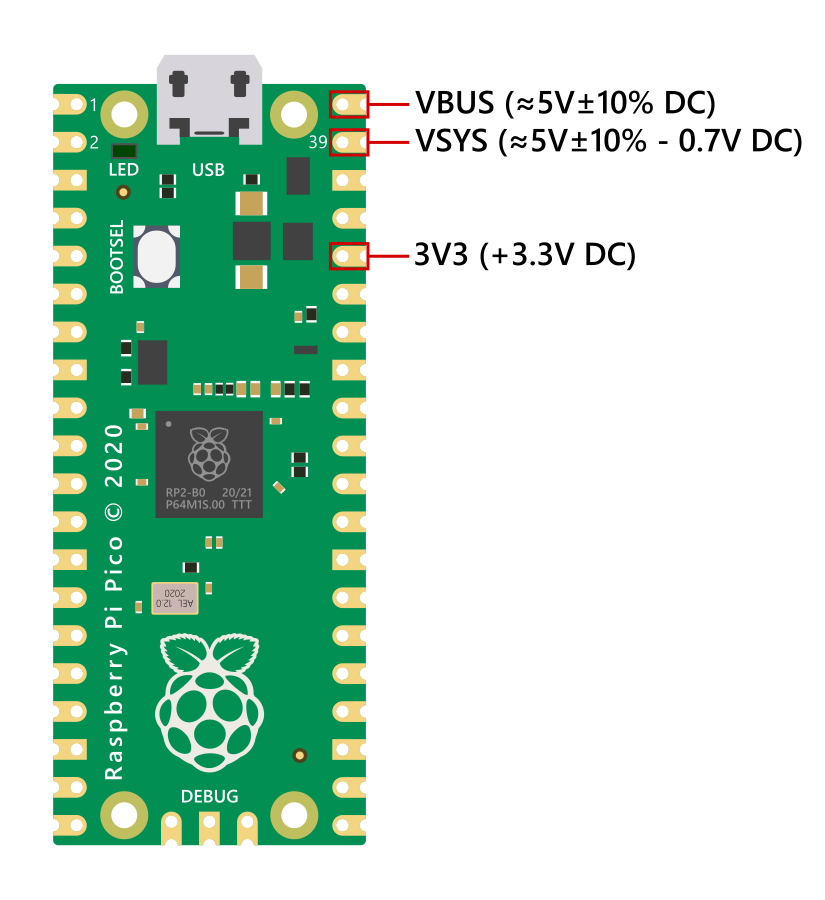

=== The Raspberry Pi Pico Platform

The Raspberry Pi Pico family is the platform used throughout this book.
It gives us a practical, low-cost target for the examples without making the hardware the main subject.

[[fig-pico-types]]
.The four Raspberry Pi Pico board variants used across the examples.
image::raspberry_pico_types.png[alt="Raspberry Pi Pico board variants",width=90%]

The family used here includes:

* Raspberry Pi Pico
* Raspberry Pi Pico W
* Raspberry Pi Pico 2
* Raspberry Pi Pico 2 W

These boards are small, affordable, and widely available, which makes them a
good fit for learning, teaching, and repeatable experiments.
They also remain capable enough to support real embedded work.
Depending on the model, Pico boards use either the *RP2040* or the newer
*RP2350* microcontroller.

=== Board capabilities

In practice, the Pico family offers the features needed for the examples in this book:

* general-purpose I/O for LEDs, buttons, sensors, and control signals
* serial interfaces such as UART, SPI, and I2C
* timers and interrupts for real-time behavior
* USB support for a simple development loop
* enough memory and processing power for useful firmware projects

=== RP2040 and RP2350

The book uses two closely related microcontrollers: the RP2040 and the RP2350.
Both fit the Pico philosophy: small enough to learn quickly, capable enough to build useful firmware.
This comparison highlights how the newer RP2350 extends the same design idea rather than replacing it.
It is included here to show what changes matter when the platform moves forward.
The RP2350 can run either ARM Cortex-M33 or RISC-V, depending on the board
variant, which makes the Pico family relevant to the RISC discussion as well.

.Raspberry Pi Pico chip identification
image::RP2040_chip_id.png[pdfwidth=50%]

.RP2040 and RP2350 at a glance
[cols="1,2,2",options="header"]
|===
|Feature             |RP2040 |RP2350
|Processor cores     |Dual-core ARM Cortex-M0+ |Dual-core ARM Cortex-M33 or dual-core Hazard3 RISC-V, depending on the variant
|Clock speed         |133 MHz |150 MHz
|Floating-point unit |None; floating point is handled in software |Dedicated hardware single and double-precision FPU
|On-chip SRAM        |264 KiB |520 KiB
|QSPI on board       |2MB|2MB|
|PIO state machines  |8 total |12 total
|Security / boot     |No secure-boot features |Secure boot, encrypted bootloader, OTP
|GPIO pins           |30 |30 to 48, depending on the package variant
|Sleep current       |~1.3 mA |~1.5 mA to 2 mA
|Typical Pico boards |Pico, Pico W |Pico 2, Pico 2 W
|Peripheral set      |GPIO, UART, SPI, I2C, timers, interrupts, USB 1.1 device controller, PIO |All RP2040 peripherals plus the newer RP2350 platform features
|Book role           |Foundation platform for core embedded concepts |Newer platform used to show the same concepts on updated hardware
|===

// https://datacapturecontrol.com/articles/io-devices/microcontrollers/rpi-pico
// RPi Pico Specs
// Parameter	Description
// Board Model	Raspberry Pi Pico
// Pico Product Brief (PDF)
// Pico Datasheet (PDF)
// Main Processor	32-bit 133MHz Dual-Core ARM Cortex-M0+
//
// RP2040 Datasheet (PDF)
// Memory	
// 264KB on-chip SRAM
// 2MB on-board QSPI Flash
// Interface	
// 1x USB 1.1 Host or Device Full/Low speed with USB Micro-B port
// 26x Digital I/O with 16x PWM
// 8x Programmable I/O (PIO) state machines for custom peripheral support
// 3x analog inputs with 12-bit 500ksps ADC
// 2x UART, 2x I2C, 2x SPI
// Note: I/O Pins are 3.3V with a maximum total current of 50mA (sum of all current being sourced/sunk by GPIO and QSPI pins)
// Timers	
// 4x timers
// Watchdog Timer (WDT)
// 2 on-chip PLLs to generate USB and core clocks
// Power	There are 3 ways to power the board
// Micro-USB B port: 5V±10% DC
// VBUS Pin: 5V±10% DC
// VSYS Pin: 1.8V to 5.5V DC
// Board has on-chip programmable LDO regulator to generate core voltage.
//
// Low-power sleep and dormant modes
// Operating Temperature	
// -20°C to 85°C (Pico and Pico H)
// -20°C to +70°C (Pico W and Pico WH)
// Board Size (LxW)	51mm x 21mm (2.01in x 0.83in)
//

The RP2350 is the stronger choice for compute-heavy examples.
Its Cortex-M33 cores and hardware FPU can make floating-point and complex math tasks up to 3× faster than the RP2040, and it can boot as either ARM or RISC-V depending on the variant.

For I/O, the RP2350 expands PIO from 8 to 12 state machines and adds HSTX for high-speed display-oriented output such as DVI and DSI.

For power-sensitive designs, the RP2040 still has the advantage.
Its lower sleep and dormant current make it a better fit for ultra-low-power, long-life battery projects.

The non-wireless boards are ideal for core firmware, timing, and peripheral work.
The wireless variants add connectivity for network-enabled examples.

This makes the Pico family a good teaching platform: the hardware is simple enough to understand quickly, but rich enough to expose the same ideas that appear in larger systems.
MicroCI currently supports this Pico family, and the same workflow can later be extended to other boards and ecosystems.

<<<
=== Pinout

.The pinout and board layout diagram of a non-wireless Raspberry Pi Pico board

.The pinout and board layout diagram of a non-wireless Raspberry Pi Pico 2 board

.The pinout and board layout diagram of a wireless Raspberry Pi Pico board

.The pinout and board layout diagram of a wireless Raspberry Pi Pico 2 board

=== Input power

There are 3 ways to power the Pico board:

* USB Micro-B port with 5V±10% DC
* VBUS Pin with 5V±10% DC
* VSYS Pin in the range of 1.8V to 5.5V DC

.Raspberry Pi Pico input power.

==== USB Input Power

The micro-USB port can power the Pico board from a computer, wall adapter,
battery, or other source that delivers 5V±10% DC. Since VBUS is directly
connected to the USB port, it can provide the same voltage to external
circuits. Likewise, VSYS can also be used to provide voltage to external
circuits, but will be slightly lower with a 0.7V voltage drop across the
Schottky diode (i.e., VSYS becomes VBUS minus the Schottky diode 0.7V voltage
drop). If the micro-USB port is the only power source, VSYS and VBUS can be
safely shorted together to eliminate the Schottky diode drop (which improves
efficiency and reduces ripple on VSYS).

==== VBUS Input Power

The Pico board could be powered by providing 5V±10% DC to the VBUS pin (Pin
40). This would internally power VSYS via the onboard Schottky diode with a
drop of 0.7V, but you must not connect another power supply to the USB
connector to avoid back-powering either source, especially when connecting to a
computer for programming.

Following VBUS in the schematic shows two resistors, R10 (5.6kΩ) and R1 (10kΩ),
as a voltage divider that brings the voltage down from 5V to 3.2V for GPIO24.
This allows GPIO24 to monitor if VBUS is on/off, while R10 and R1 act to pull
VBUS down to make sure it is 0V if VBUS is not present.

==== VSYS Input Power

The VSYS pin is a better option than VBUS for powering the Pico by pins due to
its wider input voltage range of 1.8V to 5.5V DC and makes use of the Schottky
diode to prevent the USB/VBUS and VSYS from back-powering the other. VSYS is RC
filtered and divided by 3 (by R5, R6 and C3 in the Pico schematic) and can be
monitored on ADC channel 3. This can be used for example as a crude battery
voltage monitor.

=== Output power

There are 3 pins on the Pico board that can provide 5V and 3.3V output power to
external devices provided that the Pico is powered through the USB port.

* VBUS Pin
* VSYS Pin
* 3V3 Pin

.Raspberry Pi Pico output power.

==== VBUS Pin Output Power

The VBUS pin is directly connected to the power line of the USB port, so the
voltage and current output depends on the USB power source and the voltage drop
across the USB cable. According to the USB 2.0 specs, the voltage ranges are
different for low and high power buses:

* **Low Power Bus:** The minimum voltage at the host port, hub port, and device
  are specified to be at least 4.75V, 4.4V, and 4.35V respectively and up to a
  maximum voltage of 5.25V with a max current rating of 100mA.
* **High Power Bus:* The voltage range is 4.75V to 5.25V with a max current of
  500mA.

This is assuming that the manufacturer's design of USB power source is fully
compliant with the USB specs (there are many products on the market that
deviate from the specs).

==== VSYS Pin Output Power

The VSYS pin is connected to the power line of the USB port with an inline
Schottky diode that has a voltage drop of 0.7V. The output voltage of VSYS is
the USB voltage (VBUS) minus 0.7V across Schottky diode. The current rating of
VSYS is the same as the USB current rating.

==== 3V3 Pin Output Power

The 3V3 pin outputs +3.3V from the Pico's internal SMPS regulator. The maximum
output current will depend on RP2040 load and VSYS voltage and it is
recommended to keep the load on this pin less than 300mA.

