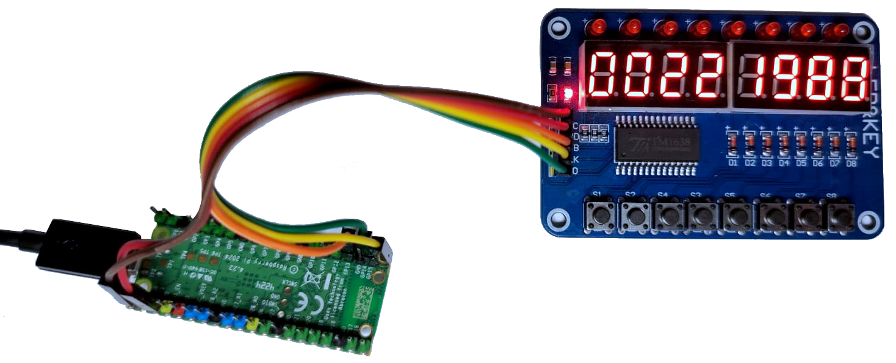

=== Controlling TM1638

For this example you need the following files from `../examples/TM1638_01/` folder:

* `TM1638_01.cpp` - C source code
* `CMakeLists.txt` - Configuration file used by the CMake meta-build system
* `.microCI.yml` - Pipeline

Once you have these three files in a folder just execute:

[source,console]
----
microCI | bash

┏━━━━━━━━━━━━━━━━━━━━━━━━━━━━━━━━━━━━━━━━━━━━━━━━━━━━━━━━━━━━━━━━━━━━┓
┃                                                                    ┃
┃                          ░░░░░░░░░░░░░░░░░                         ┃
┃                          ░░░░░░░█▀▀░▀█▀░░░                         ┃
┃                          ░░░█░█░█░░░░█░░░░                         ┃
┃                          ░░░█▀▀░▀▀▀░▀▀▀░░░                         ┃
┃                          ░░░▀░░░░░░░░░░░░░                         ┃
┃                          ░░░░░░░░░░░░░░░░░                         ┃
┃                           microCI v0.47.0                          ┃
┃           Write your pipeline once. Execute it anywhere.           ┃
┃                                                                    ┃
┃                                                                    ┃
┃                        https://microci.dev/                        ┃
┗━━━━━━━━━━━━━━━━━━━━━━━━━━━━━━━━━━━━━━━━━━━━━━━━━━━━━━━━━━━━━━━━━━━━┛

1 Build Raspberry Pi Pico firmware..........................: OK
2 Load firmware in BOOTSEL mode.............................: SKIP
----

==== .microCI.yml

In `.microCI.yml`, use `pico2_w` as the `board` value and `raspberry_pico` as plugin's `name`.

[source,yaml]
----
include::../examples/TM1638_01/.microCI.yml[]
----

==== TM1638_01.cpp

[source,cpp]
----
include::../examples/TM1638_01/TM1638_01.cpp[]
----

==== CMakeLists.txt

[source,cmake]
----
include::../examples/TM1638_01/CMakeLists.txt[]
----

==== Artifacts

After building the project the following files are available:

[listing]
----
build/TM1638_01.bin
build/TM1638_01.dis
build/TM1638_01.elf
build/TM1638_01.elf.map
build/TM1638_01.hex
build/TM1638_01.uf2
----

// include::file_format.adoc[]
// include::bootsel.adoc[]
