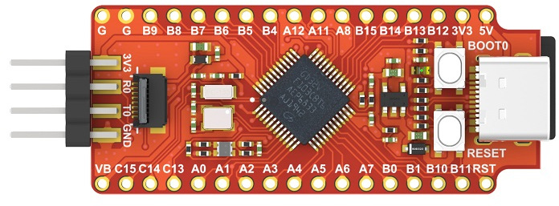
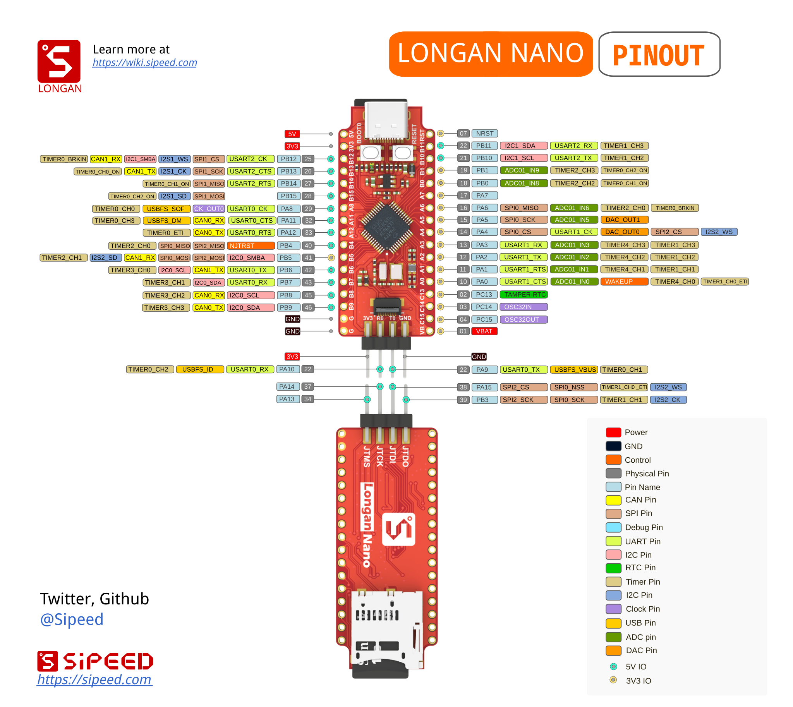

=== Sipeed Longan Nano

The Sipeed Longan Nano is a minimalist RISC-V development board based on the
GigaDevice GD32VF103CBT6. Sipeed describes it as a small board that draws out
all of the chip's I/Os and includes on-board USB-C, LCD, SD card, JTAG, and
other interfaces.

.Sipeed Longan Nano board

That makes it a useful contrast to the Raspberry Pi Pico family because it
shows a different CPU architecture and a different ecosystem while still
supporting the same embedded workflow ideas.
The board is not here to replace the Pico examples; it is here to show that the
same concepts still apply when the target hardware changes.

=== Pinout

.Sipeed Longan Nano pinout

