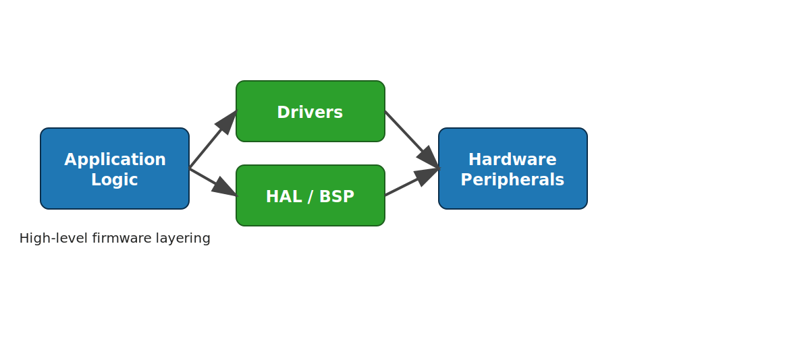

# Chapter Title

## Objective

State the goal of the chapter.

## Code example

Prefer short, focused snippets. For longer examples, store the source in `code/` and reference it from the prose.

```c
// code/example.c
#include <stdint.h>

int main(void) {
    return 0;
}
```

## Diagram

See @fig-example.

::: {#fig-example}
{width=80%}

Replace this figure with a chapter-specific diagram.
:::

## Conventions

See [Code and Listing Conventions](09-code-conventions.qmd).
