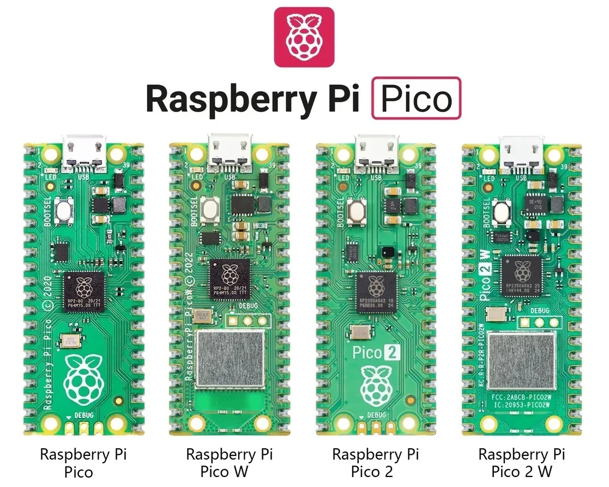

# Introduction

Embedded software is built at the intersection of hardware constraints, software structure, and long-term maintainability. This book is for readers who want to understand that intersection by working with real boards, practical examples, and a workflow that can grow with the project.

The Raspberry Pi Pico family is a good fit for that goal: the boards are low-cost, widely available, and capable enough to demonstrate the core ideas behind embedded development without hiding the underlying hardware. They are also small enough to keep the examples focused, yet complete enough to cover the full path from bring-up to testing and automation.

The Pico family used in this book includes:

- Raspberry Pi Pico
- Raspberry Pi Pico W
- Raspberry Pi Pico 2
- Raspberry Pi Pico 2 W

::: {#fig-pico-types}
{width=90%}

The four Raspberry Pi Pico board variants used across the examples.
:::

Depending on the model, Pico boards use either the **RP2040** or the newer **RP2350** microcontroller. They offer dual-core processing, enough on-chip memory for real projects, support for common peripherals, and USB drag-and-drop programming, which keeps the development loop simple.

Wireless variants such as the **Pico W** and **Pico 2 W** add connectivity for network-enabled examples, while the non-wireless boards are ideal for core firmware, timing, peripherals, and interrupt-driven code.

MicroCI currently supports this Pico family, and support for other platforms such as Arduino, ESP32, and additional targets can be added in future editions.

By the end of this book, you should be able to:

- organize embedded firmware into maintainable layers
- configure and understand a cross-compilation toolchain
- work with common peripherals and interrupt-driven code
- reason about timing, memory, and hardware constraints
- test and automate embedded projects with microCI

